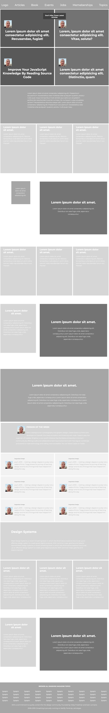

# [Design Teardown Project](https://raw.githack.com/KaushikShivam/the_next_web_clone/development/index.html) of [The Smashing Magazine](https://www.smashingmagazine.com/)



## Table of content
- [Description](#description)
- [Installation](#installation)
- [Contact](#contact)

## Description
[Design Teardown Project](https://raw.githack.com/KaushikShivam/smashing_magazine/feature-hierarchy/index.html) is built to understand visual hierarchies with the heatmap.
In this simple project, we broke apart the website for a popular design magazine.
The goal for this exercise was to train ourselves to think in terms of visual hierarchy, typography and design principles.

We created a grayscale heat map of the website that indicates which elements have the greatest weight in the visual hierarchy. 
[Reference link](Design Teardown Project)


## Installation

1. Clone the project to your local directory
```
git clone https://github.com/KaushikShivam/smashing_magazine
```
2. Open the index.html file in your browser to view the website in all its glory (Live-server is recommended to view live changes automatically)

## Contact
This template was created in collaboration with Rodolfo and myself
You can contact Rodolfo at:
- [Email](acosta.rodolfo.rca@gmail.com)

You can contact me at:
- [Email](shivamkaushikofficial@gmail.com)
- [Linkedin](https://www.linkedin.com/in/shivam-kaushik-bb8162102/)
- [Twitter](https://twitter.com/kShivamDev)
- [Medium](https://medium.com/@shivamkaushikofficial)


